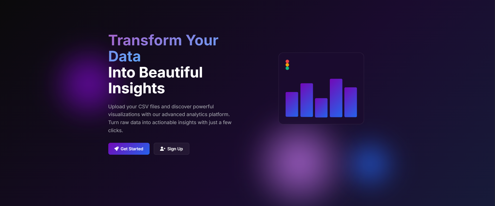
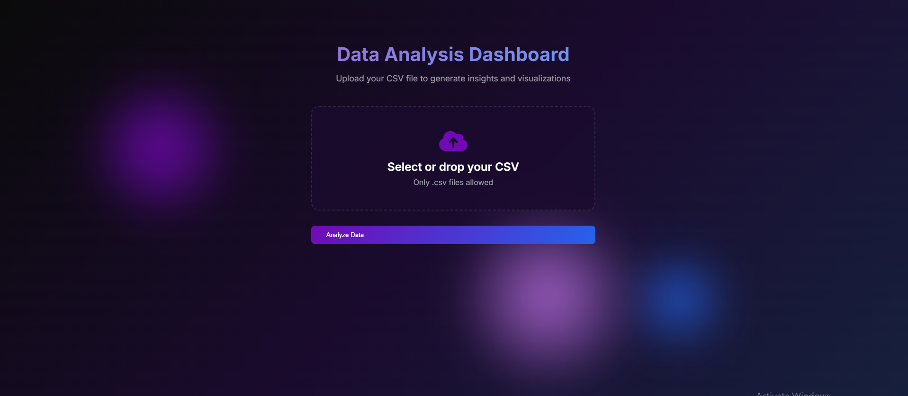

# VisionAI: AI-Powered EDA & Visualization Agent

VisionAI is a full-stack web application that leverages a sophisticated AI agent to automate the Exploratory Data Analysis (EDA) process. Users can sign up, log in, and upload their CSV datasets to receive a complete suite of auto-generated visualizations, each accompanied by insightful, AI-powered captions.

## 📸 Project Showcase

### Screenshots

Here's a glimpse of the VisionAI application in action.

**Landing Page**


**Sign Up Page**


**Product Page**


### Video Demo

For a complete walkthrough of the project, check out the video demo:

[VisionAI Demo](./website/product_video.mp4)


## 🌟 Features

* **User Authentication:** Secure signup, login, and logout functionality.
* **CSV File Upload:** An intuitive dashboard for users to upload their datasets.
* **Automated EDA:** A powerful backend agent profiles the data to identify numerical and categorical columns.
* **Dynamic Plot Generation:** Automatically creates a variety of plots based on the data's characteristics:
  * Histograms and Box Plots for numerical data distributions.
  * Bar Charts for categorical data frequencies.
  * Correlation Heatmaps for relationships between numerical features.
* **AI-Generated Captions:** Each visualization is paired with a concise, insightful summary generated by an LLM (powered by Groq).
* **Beautiful & Soothing UI:** A modern, responsive frontend built with Tailwind CSS, featuring a calming aesthetic and smooth animations.

## 🛠️ Tech Stack

* **Backend:** Flask
* **AI Agent Framework:** LangGraph, LangChain
* **LLM for Generation:** Groq
* **Embeddings & RAG:** Ollama with `nomic-embed-text`
* **Vector Store:** ChromaDB
* **Data Manipulation:** Pandas
* **Visualization:** Matplotlib & Seaborn
* **Frontend:** HTML, Tailwind CSS, JavaScript

## 📂 Project Structure

```
.
├── app.py                      # Main Flask application file
├── uploads/                    # Directory for user-uploaded CSV files
├── static/
│   ├── css/
│   │   └── style.css           # Custom CSS for UI enhancements
│   ├── js/
│   │   └── main.js           # JavaScript for frontend interactivity (e.g., loading spinner)
│   └── plots/                  # Generated plots are saved here
├── templates/
│   ├── base.html               # Base template with navbar and footer
│   ├── index.html              # Landing page
│   ├── login.html              # Login page
│   ├── signup.html             # Signup page
│   └── dashboard.html          # Main dashboard for file upload and results
└── src/
    ├── agents/
    │   └── data_visualization_agent.py # The core EDA agent logic
    ├── pipeline/
    │   ├── rag_pipeline.py     # RAG pipeline for building the knowledge base
    ├── __init__.py
    ├── exception.py            # Custom exception handling
    ├── logger.py               # Logging setup
    └── utils.py                # Utility functions (e.g., get_llm, get_dataset)
```

## ⚙️ Setup and Installation

Follow these steps to get the project running on your local machine.

### 1. Clone the Repository

```bash
git clone https://github.com/Str1nX03/VisionAI.git
cd VisionAI
```

### 2. Create and Activate a Virtual Environment

```bash
# For Windows
python -m venv .venv
.\.venv\Scripts\activate

# For macOS/Linux
python3 -m venv .venv
source .venv/bin/activate
```

### 3. Install Dependencies

Install all the required Python packages.

```bash
pip install -r requirements.txt
```

*(Note: You will need to create a `requirements.txt` file by running `pip freeze > requirements.txt` in your project's activated virtual environment.)*

### 4. Set Up Ollama

This project relies on Ollama for generating embeddings.

* **Install Ollama:** Follow the instructions on the [official Ollama website](https://ollama.com/).
* **Pull the Embedding Model:** Open your terminal and run the following command to download the required model:
  ```bash
  ollama pull nomic-embed-text
  ```
* **Run the Ollama Server:** In a **new, separate terminal window**, start the Ollama server. Keep this terminal running in the background.
  ```bash
  ollama serve
  ```

### 5. Build the RAG Knowledge Base

The agent uses a ChromaDB vector store. Run the RAG pipeline script once to build it.

```bash
python src/pipeline/rag_pipeline.py
```

This will create a `chroma_db` folder in your project root.

### 6. Set Up Environment Variables

You need a Groq API key for the LLM. Create a `.env` file in the project root and add your key:

```
GROQ_API_KEY="your-groq-api-key"
```

The application will load this key automatically.

### 7. Run the Flask Application

Now you're ready to start the web server.

```bash
python app.py
```

Navigate to `http://127.0.0.1:5000` in your web browser.

## 🚀 Usage

1. **Sign Up:** Create a new account from the landing page.
2. **Login:** Log in with your newly created credentials.
3. **Upload:** On the dashboard, click the "Upload a file" area to select a `.csv` file from your computer.
4. **Analyze:** Click the "Analyze Dataset" button. A loading animation will appear while the agent processes the data.
5. **View Results:** The page will automatically refresh to display the generated plots and their corresponding AI-powered insights.
6. **Logout:** Click the logout button in the navigation bar to end your session and return to the landing page.

## 📄 License

This project is licensed under the MIT License. See the `LICENSE` file for details.
EOF
